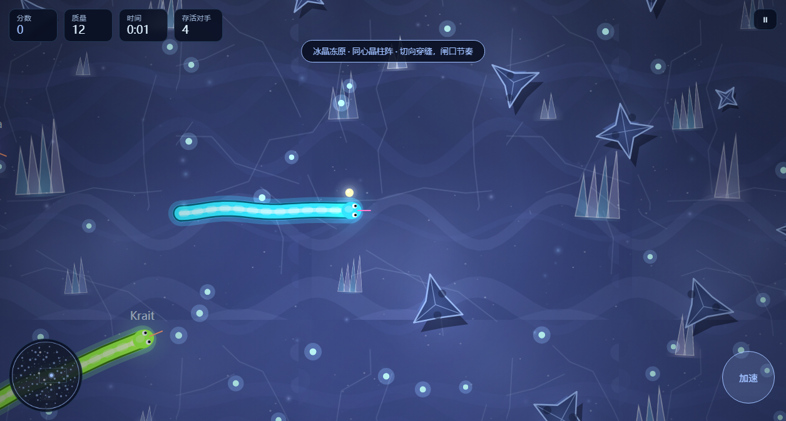

# 🐍 Neon Snake · 全向霓虹贪吃蛇

一个**零依赖、零构建**的浏览器贪吃蛇游戏：原生 ES Modules + Canvas 2D，`git clone` 之后双击 `index.html` 就能玩。为"Vibe Coding 部署课"的部署作业而做，用它替换了课件里的番茄钟。

> 🎮 **在线试玩**：<https://neon-snake-kappa.vercel.app>
> 📦 **源码仓库**：<https://github.com/ZhengXiang-sn/neon-snake>

> 备用域名：<https://neon-snake-zheng-xiang.vercel.app>（同一份生产部署的别名）
>
> 部署方式：Vercel Framework Preset = **Other**，无构建命令、无输出目录，直接托管静态文件。



## 为什么它不只是"四方向吃豆子"

| 传统贪吃蛇 | Neon Snake |
| --- | --- |
| 上下左右四个格子方向 | **360° 全向转向**：头部沿走过的路径按弧长重采样，转向带惯性限速，任意曲率都平滑 |
| 只有吃食物 | 加速冲刺（**持续烧质量**）、撞别人身体即死并爆一地宝石、AI 对手会追猎与包夹、竞技场随时间缩圈、5 种道具、连击倍率、8 个成就 |
| 蛇是一串格子 | 蛇是"轨迹采样体"：`mass` 同时决定半径、体长、速度与转向率，越胖越强也越笨重 |

## 快速开始

```bash
# 方式一：直接开文件（无需任何依赖）
# 双击 index.html 即可；如果浏览器因 ES Module 的 CORS 策略拒绝加载，用方式二

# 方式二：本地静态服务器
npm run serve          # → http://127.0.0.1:4173
```

## 操作

| 操作 | 键盘 / 鼠标 | 触屏 |
| --- | --- | --- |
| 转向 | 移动鼠标 → 蛇头朝光标；`A`/`D` 或 `←`/`→` → 相对左右转 | 手指在屏幕上拖动 → 蛇头朝手指方向 |
| 加速 | 按住鼠标左键 / `Shift` / `空格` | 双击并按住屏幕，或按住右下角「加速」 |
| 暂停 | `Esc` / `P` | 点击右上角暂停按钮 |
| 重开 | `R` | 结算面板「再来一局」 |
| 静音 | `M` | 主菜单「音效」开关 |

## 玩法规则

- **加速有代价**：速度 ×1.6，但每秒消耗 9 点质量；质量降到 14 会自动松开加速。想冲刺就要先去吃。
- **身体是武器**：任何蛇的头撞到别的蛇身即死。以小吃大靠走位，不靠体型。
- **连击**：2.6 秒内连续进食累积连击，每 3 层提升一级倍率，上限 ×8。
- **缩圈**：开局 25 秒后竞技场开始收缩，出圈即死；边缘泛红时必须往中心走。
- **道具**：护盾（免疫一次致命撞击并附带 0.9 秒无敌帧）、磁铁、减速力场、幽灵（可穿过自身）、双倍分数。
- **AI 对手**：16 方向探测 + 空间充足度加权，会觅食、会追击、会在体型占优时包夹玩家的前进方向。

## 技术要点

- **纯静态、无构建**：没有打包器、没有框架、没有运行时依赖。部署到 Vercel 时 Framework Preset 选 **Other** 即可。
- **固定时间步**：物理以 1/60 s 定步推进，与刷新率解耦（60Hz 与 144Hz 行为一致），带追帧上限防止切回前台时"死亡螺旋"。
- **热路径零分配**：碰撞用空间网格（扁平数组跨帧复用）、粒子用预分配环形池、发光用预渲染精灵 + 加性混合（不用 `shadowBlur`）、背景瓦片与渐变按 key 缓存。
- **可测的架构**：`src/core` 与 `src/game` 是纯逻辑、不碰 DOM，可以直接在 Node 里跑单元测试；渲染与 UI 层由端到端冒烟测试覆盖。

```
src/
  config.js          单一事实来源：所有可调参数与道具文案
  core/              纯工具：数学 / 随机 / 环形路径缓冲 / 定步循环 / 输入 / 音频 / 存储 / 格式化
  game/              纯逻辑：蛇 / AI / 碰撞网格 / 世界 / 相机 / 成就
  render/            渲染：主题 / 发光 / 粒子 / 背景 / 世界渲染器
  ui/                HUD 与各覆盖层面板
```

## 验证

```bash
npm run check    # 静态检查：语法 + 具名导入/导出链接（防止"少写一个 export"导致白屏）
npm test         # 单元测试（75 个，覆盖纯逻辑层）
npm run smoke    # 端到端：用系统自带 Edge/Chrome 无头跑真实页面（50 项断言 + 截图）
npm run verify   # check + test
```

`npm run smoke` 会真实地开一局、发键盘/鼠标/触屏事件、暂停继续、切主题、等自然死亡验证结算链路，并把截图写到 `docs/screenshots/`、把报告写到 `.artifacts/smoke-report.json`。

## 部署

纯静态站点，无需构建命令、无需输出目录，Framework Preset 选 **Other**。`vercel.json` 只声明了 `cleanUrls`，其余走默认。

```bash
# 首次
vercel --prod
# 关联好仓库后，之后每次推送 main 也可以直接在 Vercel 上触发重新部署
```

本次线上地址：<https://neon-snake-kappa.vercel.app>（生产别名，已指向 `main` 的构建产物）

## 文档

- [`docs/RESEARCH.md`](docs/RESEARCH.md) —— 立项前的调研：竞品玩法拆解与 Canvas 性能结论
- [`docs/DESIGN.md`](docs/DESIGN.md) —— 玩法规格（G-01…G-17）、世界模型、性能与测试计划
- [`docs/AUDIT.md`](docs/AUDIT.md) —— 三轮审计报告（两轮独立上下文审计 + 一轮提交后稳定性复核）与修复清单
- [`docs/PROGRESS.md`](docs/PROGRESS.md) —— 开发过程记录

## 许可

MIT
