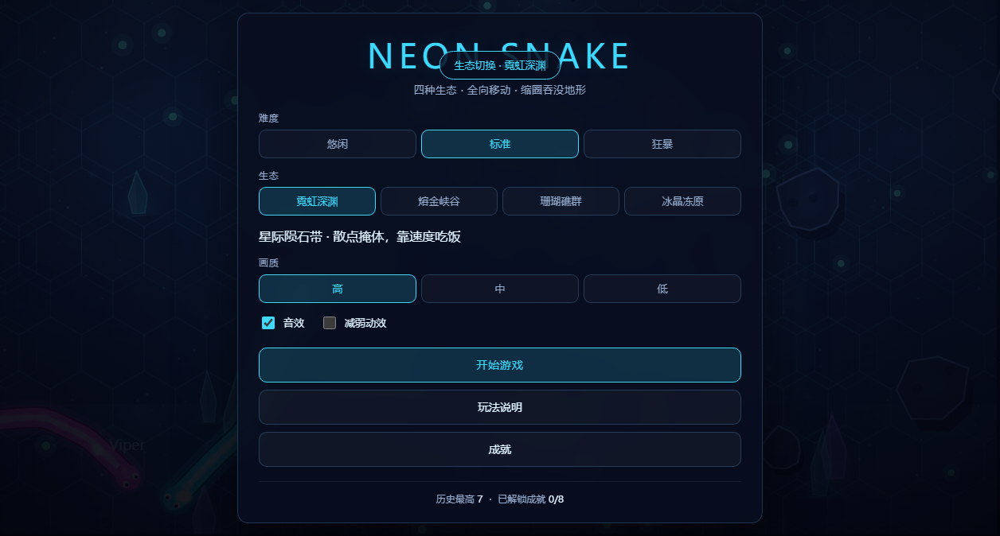
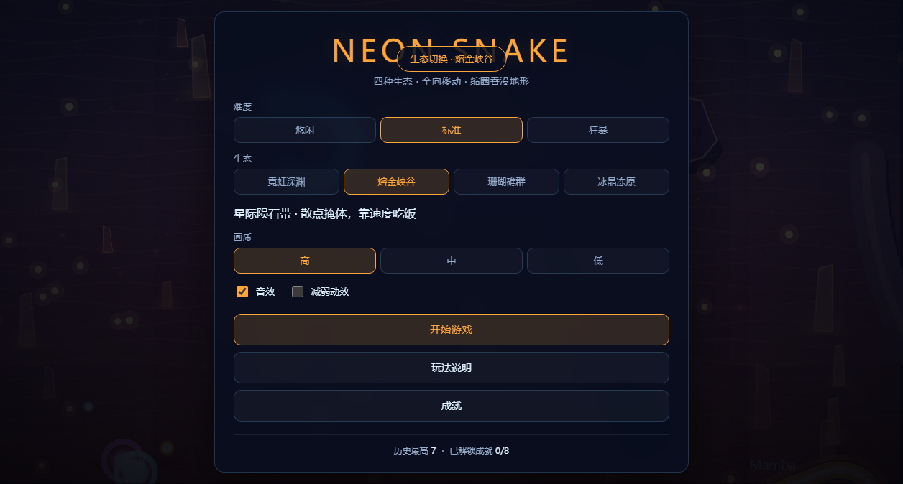
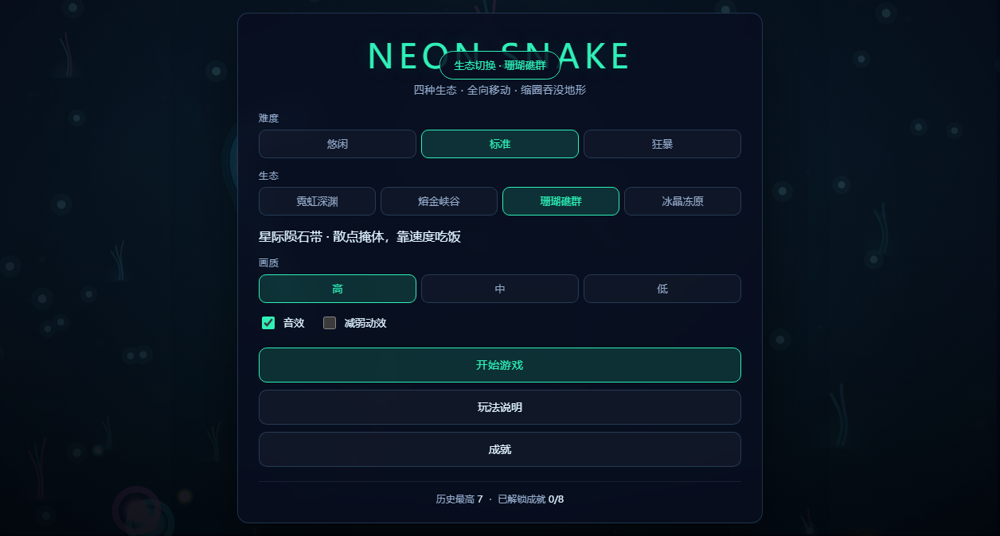
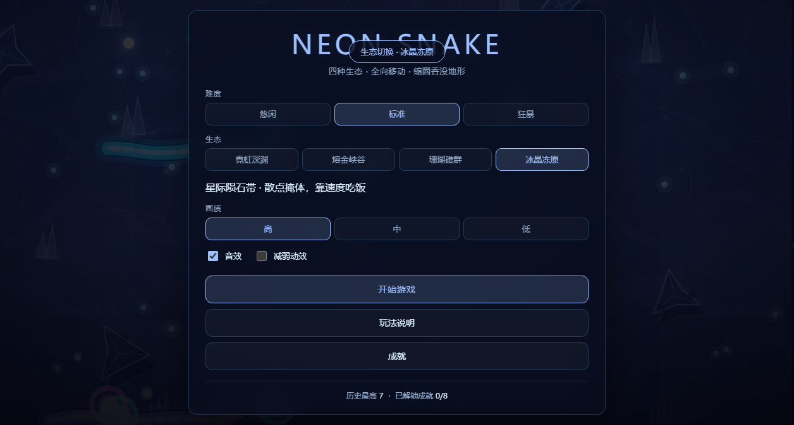

# 🐍 Neon Snake · 全向霓虹贪吃蛇

一个**零依赖、零构建**的浏览器贪吃蛇游戏：原生 ES Modules + Canvas 2D，`git clone` 之后双击 `index.html` 就能玩。为"Vibe Coding 部署课"的部署作业而做，用它替换了课件里的番茄钟。

> 🎮 **在线试玩**：<https://neon-snake-kappa.vercel.app>
> 📦 **源码仓库**：<https://github.com/ZhengXiang-sn/neon-snake>

> 备用域名：<https://neon-snake-zheng-xiang.vercel.app>（同一份生产部署的别名）
>
> 部署方式：Vercel Framework Preset = **Other**，无构建命令、无输出目录，直接托管静态文件。


四种生态的实机画面（由冒烟测试自动采集，非手绘）：

| 霓虹深渊 | 熔金峡谷 |
| --- | --- |
|  |  |
| **珊瑚礁群** | **冰晶冻原** |
|  |  |

## 为什么它不只是"四方向吃豆子"

| 传统贪吃蛇 | Neon Snake |
| --- | --- |
| 上下左右四个格子方向 | **360° 全向转向**：头部沿走过的路径按弧长重采样，转向带惯性限速，任意曲率都平滑 |
| 只有吃食物 | 加速冲刺（**持续烧质量**）、撞别人身体即死并爆一地宝石、AI 对手会追猎与包夹、竞技场随时间缩圈、5 种道具、连击倍率、8 个成就 |
| 蛇是一串格子 | 蛇是"轨迹采样体"：`mass` 同时决定半径、体长、速度与转向率，越胖越强也越笨重 |
| 一张固定地图 | **四种生态，地形算法与走位策略都不同**（见下节），切换生态会实时重建地形 |

## 四种生态（地形 + 画面是两套独立配方）

菜单里的"生态"不只是换配色 —— 每个生态是**一套专属的地形布局算法 × 一整套视觉配方**（天幕 / 地面纹理 / 装饰物 / 环境粒子 / 障碍物材质 / 强调色）。切生态时地形实时重生成，并保证不会把蛇埋进石头里。

| 生态 | 地形布局 | 走位策略 | 天幕 · 地面 · 装饰 |
| --- | --- | --- | --- |
| **霓虹深渊** | 散点陨石 + 3 处巨型地标 | 靠速度绕掩体，开阔处拼操作 | 星云 · 六边形网 · 水晶簇 |
| **熔金峡谷** | 5 道折线峡壁 + 岩台 | 贴墙穿缝，墙是掩体也是陷阱 | 沙丘 · 涟漪沙纹 · 石柱 |
| **珊瑚礁群** | 团簇型礁体（团内可穿） | 团间留缝，逼你走窄口 | 深海 · 沙底 · 海草 |
| **冰晶冻原** | 同心环晶柱阵（带闸口） | 切向穿缝，节奏感最强 | 极光 · 冰裂 · 冰锥 |

障碍物按**内圈（终局圈内，永久保留）+ 外圈（缩圈时被整片吞噬）**两段分布，铺满整片竞技场，而不是挤在中心。墙体用折线 + 圆头绘制，其几何恰好等于"沿折线的圆盘并集"，与碰撞用的逐节点圆判定完全一致 —— 长墙不需要额外的胶囊碰撞数学。

## 快速开始

```bash
# 方式一：直接开文件（无需任何依赖）
# 双击 index.html 即可；如果浏览器因 ES Module 的 CORS 策略拒绝加载，用方式二

# 方式二：本地静态服务器
npm run serve          # → http://127.0.0.1:4173
```

## 操作

| 操作 | 键盘 / 鼠标 | 触屏 |
| --- | --- | --- |
| 转向 | 移动鼠标 → 蛇头朝光标；`A`/`D` 或 `←`/`→` → 相对左右转 | 手指在屏幕上拖动 → 蛇头朝手指方向 |
| 加速 | 按住鼠标左键 / `Shift` / `空格` | 双击并按住屏幕，或按住右下角「加速」 |
| 暂停 | `Esc` / `P` | 点击右上角暂停按钮 |
| 重开 | `R` | 结算面板「再来一局」 |
| 静音 | `M` | 主菜单「音效」开关 |

## 玩法规则

- **加速有代价**：速度 ×1.6，但每秒消耗 9 点质量；质量降到 14 会自动松开加速。想冲刺就要先去吃。
- **身体是武器**：任何蛇的头撞到别的蛇身即死。以小吃大靠走位，不靠体型。
- **连击**：2.6 秒内连续进食累积连击，每 3 层提升一级倍率，上限 ×8。
- **缩圈**：开局 25 秒后竞技场开始收缩，出圈即死；边缘泛红时必须往中心走。
- **缩圈会吞没地形**：竞技场缩到哪里，那里的障碍物就被整片吞噬并炸成尘埃环 —— 终局场地会越来越干净，同时**墙体是整体塌陷的**，绝不会留半截墙把你和对手隔开。
- **道具**：护盾（免疫一次致命撞击并附带 0.9 秒无敌帧）、磁铁、减速力场、幽灵（可穿过自身）、双倍分数。
- **AI 对手**：16 方向探测 + 空间充足度加权，会觅食、会追击、会在体型占优时包夹玩家的前进方向。

## 技术要点

- **纯静态、无构建**：没有打包器、没有框架、没有运行时依赖。部署到 Vercel 时 Framework Preset 选 **Other** 即可。
- **程序化场景，不加载任何图片素材**：天幕视差层、世界锁定的无缝地面纹理、装饰物（水晶/石柱/海草/冰锥）全部在 `setTheme` 时按配方预渲染成离屏精灵，热路径只剩 `drawImage`。**零外部资源、零网络请求**，也因此没有素材版权与加载失败问题。
- **固定时间步**：物理以 1/60 s 定步推进，与刷新率解耦（60Hz 与 144Hz 行为一致），带追帧上限防止切回前台时"死亡螺旋"。
- **三档画质 + 无障碍开关**：画质只影响"画多少"（装饰数量、粒子上限、DPR 上限），不影响"画什么"，且**随画质变化立即生效**（含低帧率时的自动降级）。`减弱动效` 会撤掉空气粒子、装饰摇摆、旋转刻度环与跑马灯警示，但**保留全部景物与信息性提示** —— 边界与缩圈预警照常可见。这条链路由端到端测试通过模拟系统偏好 + 重载页面来验证，而不是靠人工点开关。
- **热路径零分配**：碰撞用空间网格（扁平数组跨帧复用）、粒子用预分配环形池、发光用预渲染精灵 + 加性混合（不用 `shadowBlur`）、场景层与地面瓦片按 key 缓存（**用数值比较，不逐帧拼字符串**）。障碍物材质分两趟绘制（先全部投影、再全部本体），避免脏重叠。
- **可测的架构**：`src/core` 与 `src/game` 是纯逻辑、不碰 DOM（含地形生成器），可以直接在 Node 里跑单元测试；渲染与 UI 层由端到端冒烟测试覆盖。

```
src/
  config.js          单一事实来源：所有可调参数与道具文案
  core/              纯工具：数学 / 随机 / 环形路径缓冲 / 定步循环 / 输入 / 音频 / 存储 / 格式化
  game/              纯逻辑：蛇 / AI / 碰撞网格 / 世界 / 地形生成器 / 相机 / 成就
  render/            渲染：主题 / 场景 / 障碍物 / 发光 / 粒子 / 世界渲染器
  ui/                HUD 与各覆盖层面板
```

## 验证

```bash
npm run check    # 静态检查：语法 + 具名导入/导出链接（防止"少写一个 export"导致白屏）
npm test         # 单元测试（108 个，覆盖纯逻辑层，含地形分布与缩圈节奏不变量）
npm run smoke    # 端到端：用系统自带 Edge/Chrome 无头跑真实页面（61 项断言 + 逐生态截图）
npm run verify   # check + test
```

`npm run smoke` 会真实地开一局、发键盘/鼠标/触屏事件、暂停继续、**逐个切换四种生态并比对地形与画面指纹**、模拟系统"减少动效"偏好并重载验证整条链、等自然死亡验证结算链路，并把截图写到 `docs/screenshots/`、把报告写到 `.artifacts/smoke-report.json`。

> "四种生态不是换皮"这件事是被自动化断言锁住的：冒烟测试在每个生态下取地形指纹与画布指纹，要求**四项地形各不相同、四项画面各不相同、每个生态的装饰物数量 > 0、强调色随生态同步**。

### 地形分布不变量（单测覆盖）

旧版把 22 块陨石全塞进半径 340~653 的窄环（可用面积 0.98M），而开局竞技场半径 1900（面积 11.3M）—— 视觉上就是"中心一坨"。现在 `tests/terrain.test.js` / `tests/world.test.js` 断言：

- 障碍物**向外铺满整个竞技场**（平均半径达到场地半径的 **62%**，而不是龟缩在 26% 以内）
- 任意两个障碍物**不重叠**（同结构内部除外：墙的相邻节点、礁团的成员本就该连成一体）
- 障碍物**最外缘不得探出开局竞技场**（否则会在第一帧就被缩圈吞掉，表现为开局爆一圈粒子）
- **外圈必须存在地形**，供缩圈时吞没
- 同种子**完全可复现**；地形随机源与玩法随机源**相互独立**，改地形不会连带改变 AI 与掉落
- **缩圈吞没节奏贯穿全程**：最后一次吞没必须贴近终局圈（末端空档 ≤ 110），相邻两次吞没之间不得留下大空档（≤ 170）—— 这条是防"缩到一半就没东西可吃"的观感断裂
- 墙体是**整体**的：缩圈时要么整道消失、要么完整保留，不会残留半截墙把场地切成两半
- 食物**绝不落在障碍物内部**（内圈石头终局也不会溶解，埋进去就整局吃不到）

## 部署

纯静态站点，无需构建命令、无需输出目录，Framework Preset 选 **Other**。`vercel.json` 只声明了 `cleanUrls`，其余走默认。

```bash
# 首次
vercel --prod
# 关联好仓库后，之后每次推送 main 也可以直接在 Vercel 上触发重新部署
```

本次线上地址：<https://neon-snake-kappa.vercel.app>（生产别名，已指向 `main` 的构建产物）

## 文档

- [`docs/RESEARCH.md`](docs/RESEARCH.md) —— 立项前的调研：竞品玩法拆解与 Canvas 性能结论
- [`docs/DESIGN.md`](docs/DESIGN.md) —— 玩法规格（G-01…G-17）、世界模型、性能与测试计划
- [`docs/AUDIT.md`](docs/AUDIT.md) —— 审计报告（三轮独立上下文代码审计 + 一轮交付校验 + 一轮迭代版审计）与修复清单
- [`docs/PROGRESS.md`](docs/PROGRESS.md) —— 开发过程记录

## 许可

MIT
